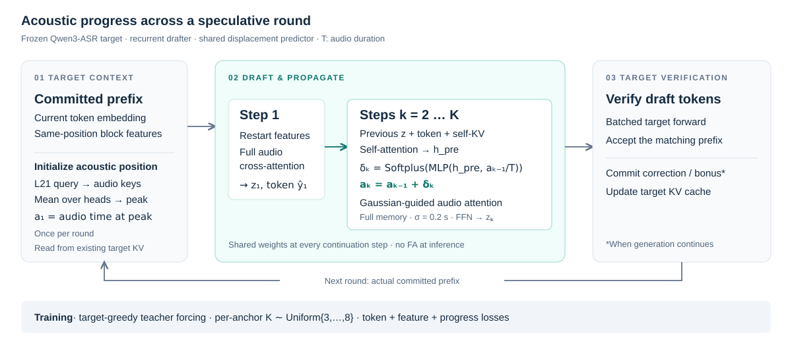

<h1 align="center">ProgDraft: Acoustic Progress Propagation for Speculative ASR</h1>

<p align="center">
  <strong>Acoustic Progress Propagation for Long-Horizon Speculative Decoding in ASR</strong><br>
  Yuanyuan Jia · Qianqian Yang<br>
  Zhejiang University
</p>

<p align="center">
  <a href="https://github.com/yuanyuanjia71-spec/ProgDraft/actions/workflows/tests.yml"></a>
  
  
</p>

<p align="center">
  <a href="#overview">Overview</a> ·
  <a href="#quick-start">Quick start</a> ·
  <a href="#training">Training</a> ·
  <a href="#evaluation">Evaluation</a> ·
  <a href="docs/README.md">Documentation</a> ·
  <a href="README.zh-CN.md">简体中文</a>
</p>

> **Release status:** source code and configurations are available. Paper, checkpoint and frozen-cache download links are pending. Inference requires a matching ProgDraft checkpoint; exact training replay also requires the original initialization and caches. See [data and assets](docs/data_and_assets.md).

## Overview

**ProgDraft propagates an explicit acoustic position across draft steps.** A shared predictor estimates positive displacements from the drafter's hidden state and current acoustic position. The accumulated position guides audio cross-attention through a Gaussian bias. The target remains frozen and verifies the proposed tokens.

<p align="center">
  
</p>

- **Acoustic progress propagation:** initialize from the current target L21 attention peak, then recursively predict positions without forced alignment at inference.
- **Variable-horizon training:** jointly train the drafter and progress predictor with a horizon sampled from K = 3–8 for each training anchor.
- **Cached speculative decoding:** generate draft tokens, verify them with the frozen target, and update the committed prefix and KV cache.

This repository contains **Ours: Joint Progress-Aware + Random-K[3,8]** for two frozen targets:

| Target | Drafter parameters | Progress predictor | Configuration |
| :--- | ---: | ---: | :--- |
| Qwen3-ASR-0.6B | 17,846,272 | 591,105 | [0.6B](configs/qwen3_asr_0.6b.json) |
| Qwen3-ASR-1.7B | 71,344,128 | 1,115,393 | [1.7B](configs/qwen3_asr_1.7b.json) |

The [implementation reference](docs/implementation.md) specifies token indexing, acoustic coordinates, loss reductions and the differences between model scales.

## Quick start

### 1. Install

Use Python 3.11 and install PyTorch 2.11 for your CUDA environment. Then:

```bash
git clone https://github.com/yuanyuanjia71-spec/ProgDraft.git
cd ProgDraft
python -m pip install -e '.[asr]'
```

The tested environment uses CUDA 12.8, Transformers 4.57.6 and qwen-asr 0.0.6. [Installation](docs/installation.md) covers CPU checks and optional forced-alignment dependencies.

### 2. Prepare weights

Place the matching ProgDraft weights at `artifacts/0.6b/ours.safetensors` or supply their actual path. Public download links are pending; [asset status and checksums](docs/data_and_assets.md) identify the required files. The frozen target is downloaded automatically from the pinned upstream revision.

### 3. Transcribe

```bash
progdraft-decode \
  --config configs/qwen3_asr_0.6b.json \
  --weights artifacts/0.6b/ours.safetensors \
  --audio data/example.wav \
  --k 8
```

For 1.7B, use `configs/qwen3_asr_1.7b.json` and its matching checkpoint. [Inference](docs/inference.md) documents device selection, local target snapshots and output fields.

## Training

Training uses frozen-target greedy trajectories, teacher-forced token inputs, and recursively predicted acoustic positions. The full drafter and progress predictor are optimized jointly; target weights, token embeddings, the LM head and audio features remain frozen.

With the complete training cache and original step-0 initialization:

```bash
progdraft-train \
  --config configs/qwen3_asr_0.6b.json \
  --initial-weights artifacts/0.6b/step0.safetensors \
  --manifest artifacts/0.6b/manifest.jsonl \
  --output runs/ours_0.6b
```

The recipe uses 3,933 training utterances, 250 validation utterances, 45 epochs and 14,760 optimizer steps. [Reproduction](docs/reproduction.md) covers cache preparation, exact-asset replay and resuming a run. [Loss definitions](docs/implementation.md#random-horizon-and-exact-loss) document the final Random-K objective.

## Evaluation

Run ProgDraft and target-only autoregressive decoding on the same GPU and audio manifest:

```bash
progdraft-benchmark \
  --config configs/qwen3_asr_0.6b.json \
  --weights artifacts/0.6b/ours.safetensors \
  --manifest data/test.jsonl \
  --output runs/test_k8 \
  --k 8
```

The benchmark reports **WER, CER, E2E speedup and Mean Accepted**, both overall and per dataset. Mean Accepted includes actually emitted correction/bonus tokens. Token sequences must match target-only decoding before aggregate speedup is written.

See [benchmark inputs and timing](docs/runtime.md) for the manifest schema, warm-up, timing boundaries and numerical settings. Experimental result directories are not distributed with the source.

## Repository guide

```text
ProgDraft/
├── configs/              # Scale-specific model and training settings
├── src/progress_asr/     # Models, training, inference and benchmarking
├── manifests/           # Dataset membership, revisions and checksums
├── scripts/             # Conversion of existing research assets
├── tests/               # Training and verifier contract checks
└── docs/                # Guides, method reference and validation records
```

Start with the [documentation index](docs/README.md). The [validation record](docs/validation.md) describes the checks performed during packaging and their limits. Development instructions are in [CONTRIBUTING.md](CONTRIBUTING.md).

## Citation

**Acoustic Progress Propagation for Long-Horizon Speculative Decoding in ASR**

Yuanyuan Jia and Qianqian Yang, Zhejiang University.

The paper link and publication details will be added when available. Software citation metadata are provided in [CITATION.cff](CITATION.cff).

## Acknowledgments and license

ProgDraft builds on [Qwen3-ASR](https://github.com/QwenLM/Qwen3-ASR), PyTorch and [TorchAudio MMS-FA](https://docs.pytorch.org/audio/stable/tutorials/forced_alignment_for_multilingual_data_tutorial.html). Third-party models, software and datasets retain their respective terms; see [third-party notices](THIRD_PARTY_NOTICES.md).

The project license is **TBD**. A formal `LICENSE` will be added once selected; no license grant is implied by this placeholder.
