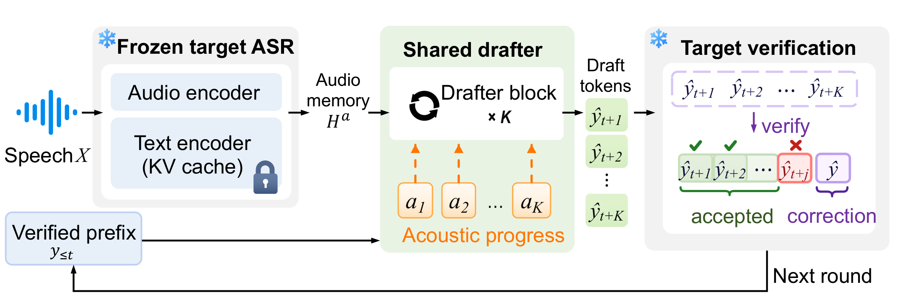
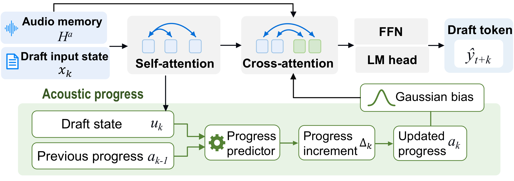

<h1 align="center">ProgDraft: Acoustic Progress Propagation for Speculative ASR</h1>

<p align="center">
  <strong>Acoustic Progress Propagation for Long-Horizon Speculative Decoding in ASR</strong><br>
  Yuanyuan Jia · Qianqian Yang<br>
  Zhejiang University
</p>

<p align="center">
  <a href="README.md">English</a> ·
  <a href="#方法概览">方法概览</a> ·
  <a href="#快速开始">快速开始</a> ·
  <a href="#训练与评估">训练与评估</a> ·
  <a href="docs/README.md">完整文档</a>
</p>

> **发布状态：**源码与配置已公开。论文、模型权重和冻结训练缓存的下载链接待补充。推理需要对应规模的 ProgDraft 权重；精确重放训练还需要原始初始化和缓存，详见[数据与资产](docs/data_and_assets.md)。

## 方法概览

**ProgDraft 在连续草稿步骤之间递归传播显式声学位置。** 共享预测器根据当前隐藏状态与声学位置预测非负位移；累积位置通过 Gaussian bias 引导音频交叉注意力。冻结 target 验证草稿词元。

<p align="center">
  
  <br>
  <em>(a) 声学进度引导的投机 ASR 解码流程。</em> <a href="docs/assets/asr_fig1.pdf">PDF</a>
</p>

<p align="center">
  
  <br>
  <em>(b) 共享 drafter 模块。</em> <a href="docs/assets/asr_fig2.pdf">PDF</a>
</p>

- **声学进度传播：**每轮从当前 target L21 attention peak 初始化位置，后续步骤递归预测；推理不使用强制对齐信息。
- **可变深度训练：**每个训练 anchor 独立采样 K=3–8，联合训练 drafter 与 progress predictor。
- **真实缓存投机解码：**自由生成候选，由 target 批量验证，随后更新已提交前缀与 KV cache。

本仓库包含 **Ours：Joint Progress-Aware + Random-K[3,8]** 的两套配置：

| 冻结 Target | Drafter 参数量 | Progress predictor 参数量 | 配置 |
| :--- | ---: | ---: | :--- |
| Qwen3-ASR-0.6B | 17,846,272 | 591,105 | [0.6B](configs/qwen3_asr_0.6b.json) |
| Qwen3-ASR-1.7B | 71,344,128 | 1,115,393 | [1.7B](configs/qwen3_asr_1.7b.json) |

词元位置、音频时间坐标、loss reduction 及两种规模的配置差异见[实际实现](docs/implementation.md)。

## 快速开始

使用 Python 3.11，先安装适配本机 CUDA 的 PyTorch 2.11，再执行：

```bash
git clone https://github.com/yuanyuanjia71-spec/ProgDraft.git
cd ProgDraft
python -m pip install -e '.[asr]'
```

取得对应权重后运行：

```bash
progdraft-decode \
  --config configs/qwen3_asr_0.6b.json \
  --weights artifacts/0.6b/ours.safetensors \
  --audio data/example.wav \
  --k 8
```

1.7B 使用对应配置与权重。更多参数见[安装](docs/installation.md)和[推理](docs/inference.md)。当前权重下载链接尚未发布，示例路径需要用户提供实际文件。

## 训练与评估

训练使用 target greedy trajectory 的 teacher-forced token；隐藏状态、self-KV 和声学位置递归传播。Target、embedding、LM head 与音频表示冻结，完整 drafter 和 progress predictor 参与联合训练。

```bash
progdraft-train \
  --config configs/qwen3_asr_0.6b.json \
  --initial-weights artifacts/0.6b/step0.safetensors \
  --manifest artifacts/0.6b/manifest.jsonl \
  --output runs/ours_0.6b
```

完整训练需要 3,933 条训练语音与固定 250 条验证语音的缓存，训练 45 epochs / 14,760 steps。[复现指南](docs/reproduction.md)说明缓存准备、原始资产导出及断点恢复。

在同一 GPU 上与 target-only 配对评估：

```bash
progdraft-benchmark \
  --config configs/qwen3_asr_0.6b.json \
  --weights artifacts/0.6b/ours.safetensors \
  --manifest data/test.jsonl \
  --output runs/test_k8 \
  --k 8
```

输出 **WER、CER、E2E speedup、Mean Accepted**，分别统计整体与各数据集。Mean Accepted 包含实际输出的 correction/bonus token；输出 token IDs 与 target-only 不一致时停止，不生成整体 speedup。完整计时范围与数值设置见[运行协议](docs/runtime.md)。仓库不附带实验结果目录。

## 文档与发布信息

- [文档导航](docs/README.md)：安装、训练、推理、评估与实现细节。
- [数据与资产](docs/data_and_assets.md)：数据 ID、版本、权重状态及校验值。
- [验证记录](docs/validation.md)：已有契约测试、原实现等价检查及覆盖范围。
- [开发说明](CONTRIBUTING.md)：本地检查与问题反馈。

论文链接与正式引用信息待补充，作者信息见 [CITATION.cff](CITATION.cff)。许可证为 **TBD**，确定后添加正式 `LICENSE`；当前占位文字不授予开源许可。第三方组件见 [THIRD_PARTY_NOTICES.md](THIRD_PARTY_NOTICES.md)。
